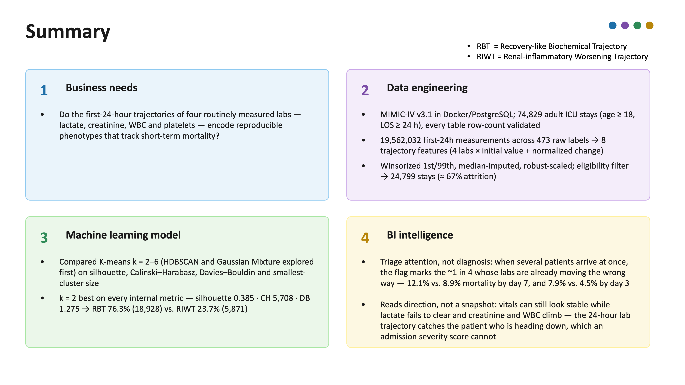
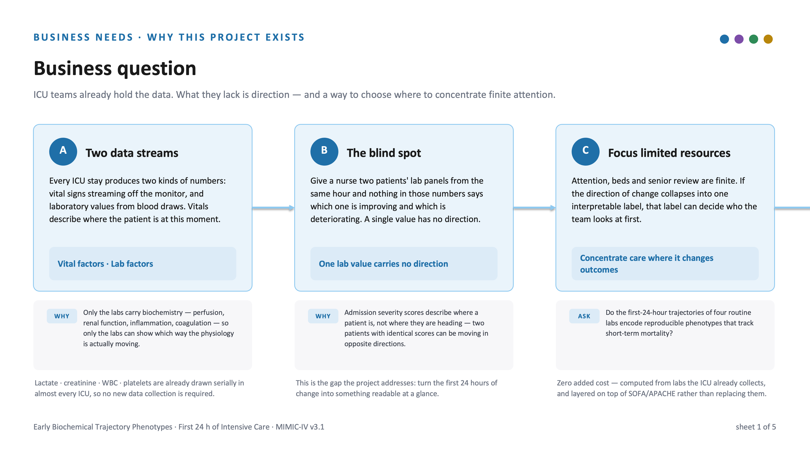
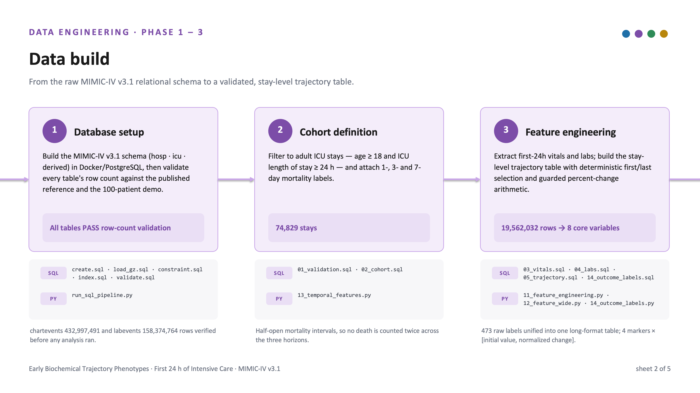
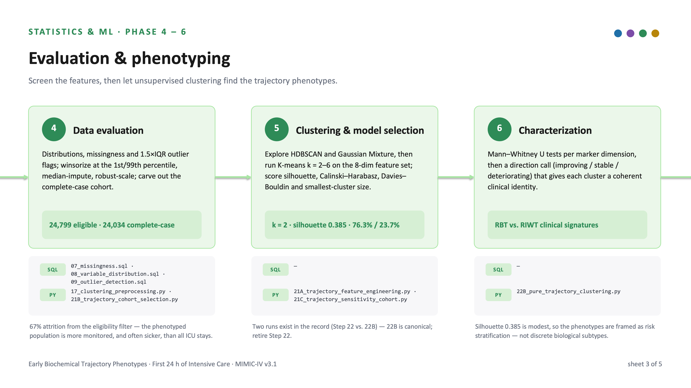
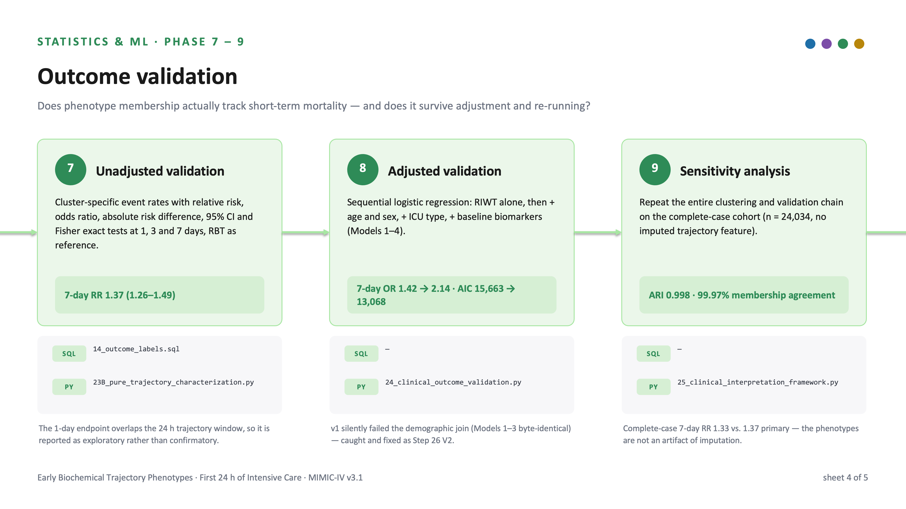
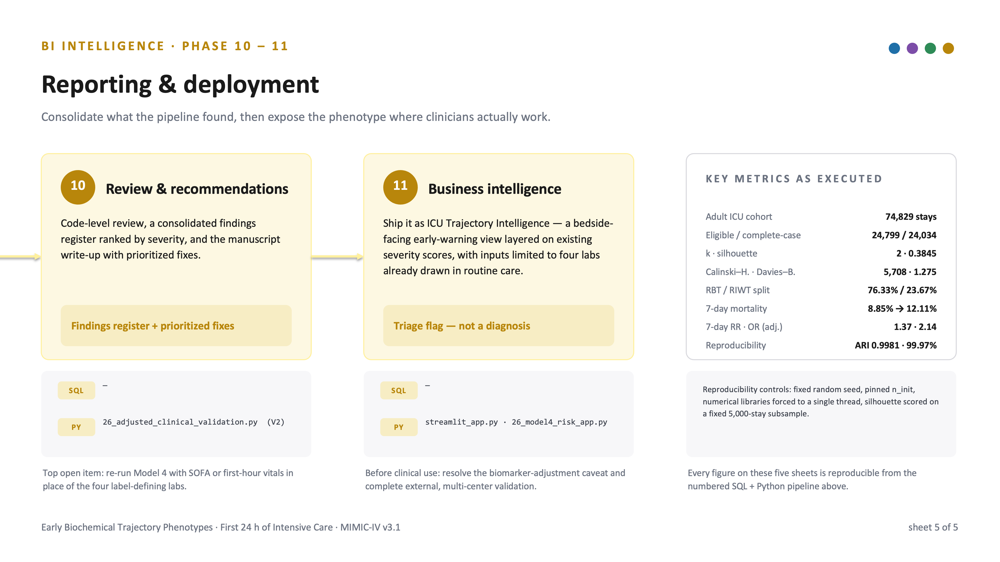

# ICU Trajectory Watch

**Early Biochemical Trajectory Phenotypes in the First 24 Hours of Intensive Care and Their Association with Short-Term Mortality**

DongHwan Won | Dylan H. Won — Aug 2026

## Summary













## Business Question
Using only four biochemical markers that are already measured serially in almost every ICU, can the direction of change over the first 24 hours be reduced to a small number of stable, interpretable phenotypes — and do those phenotypes track short-term mortality?

Two patients who look identical on an admission severity score may be moving in opposite directions, one stabilizing and the other deteriorating, and conventional risk instruments describe where a patient is rather than where they are heading. Lactate reflects tissue perfusion and its clearance is an established resuscitation target; creatinine indexes evolving acute kidney injury; WBC and platelet trajectories reflect the inflammatory and coagulation response. Together they summarize perfusion, renal and inflammatory dynamics without requiring any data collection beyond routine care.

## Business Intelligence: streamlit site
[< Streamlit 앱 URL>](https://)

## Conclusion

On 74,829 adult ICU stays from MIMIC-IV v3.1, an unsupervised K-means pipeline identified an optimal two-cluster solution on the eligible cohort of 24,799 stays: a lower-risk **Recovery-like Biochemical Trajectory** (RBT, 76.3%, n = 18,928) and a higher-risk **Renal-inflammatory Worsening Trajectory** (RIWT, 23.7%, n = 5,871), selected at k = 2 on every internal validity metric (silhouette 0.3845, Calinski–Harabasz 5,708, Davies–Bouldin 1.275). RIWT membership was associated with significantly higher mortality at 1, 3 and 7 days — 7-day mortality 8.85% versus 12.11%, RR 1.37 (95% CI 1.26–1.49) — and the association survived sequential adjustment for age, sex, ICU type and baseline biomarker levels, with the 7-day odds ratio moving from 1.42 to 2.14 across Models 1–4. The partition reproduced almost exactly on the complete-case cohort (n = 24,034; adjusted Rand index 0.998, membership agreement 99.97%), indicating real trajectory structure rather than an artifact of imputation. Because the phenotype is computed entirely from labs ICUs already collect, it can act as a lightweight, zero-additional-cost early-warning signal layered on top of existing severity scores, and it is served that way in **ICU Trajectory Watch**. Two conditions remain before any clinical use: Model 4 adjusts on the same baseline biomarkers that helped define the label and should be re-run with an independent severity score (SOFA or first-hour vitals), and external multi-center validation has not been performed — MIMIC-IV is a single-institution, retrospective dataset, further narrowed by an eligibility filter that excluded 67% of stays.

#### References
[1] Johnson AEW, Bulgarelli L, Shen L, et al. MIMIC-IV, a freely accessible electronic health record dataset. Scientific Data. 2023;10:1.
[2] Seymour CW, Kennedy JN, Wang S, et al. Derivation, validation, and potential treatment implications of novel clinical phenotypes for sepsis. JAMA. 2019;321(20):2003–2017.
[3] Jansen TC, van Bommel J, Schoonderbeek FJ, et al. Early lactate-guided therapy in intensive care unit patients: a multicenter, open-label, randomized controlled trial. American Journal of Respiratory and Critical Care Medicine. 2010;182(6):752–761.
[4] Kellum JA, Lameire N, for the KDIGO AKI Guideline Work Group. Diagnosis, evaluation, and management of acute kidney injury: a KDIGO summary. Critical Care. 2013;17:204.
[5] Vincent JL, Moreno R, Takala J, et al. The SOFA (Sepsis-related Organ Failure Assessment) score to describe organ dysfunction/failure. Intensive Care Medicine. 1996;22(7):707–710.
[6] Rousseeuw PJ. Silhouettes: a graphical aid to the interpretation and validation of cluster analysis. Journal of Computational and Applied Mathematics. 1987;20:53–65.
[7] MacQueen J. Some methods for classification and analysis of multivariate observations. In: Proceedings of the Fifth Berkeley Symposium on Mathematical Statistics and Probability. 1967;1:281–297.
[8] Caliński T, Harabasz J. A dendrite method for cluster analysis. Communications in Statistics. 1974;3(1):1–27.
[9] Davies DL, Bouldin DW. A cluster separation measure. IEEE Transactions on Pattern Analysis and Machine Intelligence. 1979;PAMI-1(2):224–227.
[10] Pedregosa F, Varoquaux G, Gramfort A, et al. Scikit-learn: machine learning in Python. Journal of Machine Learning Research. 2011;12:2825–2830.
[11] Streamlit Inc. Streamlit documentation. [Online]. Available: https://docs.streamlit.io

## Project Structure

```text
Hospital_ICU/
├── docker/
│   └── docker-compose.yml                     # PostgreSQL instance hosting MIMIC-IV v3.1
│
├── sql/                                       # numbered data-build pipeline
│   ├── create.sql                             # schema initialization
│   ├── load.sql · load_gz.sql · load_7z.sql   # raw MIMIC-IV table loading
│   ├── constraint.sql · index.sql             # keys and query-performance indexes
│   ├── validate.sql · validate_demo.sql       # row-count validation vs. published totals
│   ├── 01_validation.sql
│   ├── 02_cohort.sql                          # adult ICU stays, age ≥ 18, LOS ≥ 24 h
│   ├── 03_vitals.sql
│   ├── 04_labs.sql
│   ├── 05_trajectory.sql                      # first-24h trajectory table
│   ├── 06_dataset_summary.sql
│   ├── 07_missingness.sql
│   ├── 08_variable_distribution.sql
│   ├── 09_outlier_detection.sql               # 1.5×IQR flags for plausibility review
│   ├── 10_temporal_analysis.sql
│   ├── 11_variable_distribution.sql
│   ├── 14_outcome_labels.sql                  # 1-, 3-, 7-day mortality labels
│   └── Conceptual schema for MIMIC IV/
│       ├── A_admission_transfer.png
│       ├── B_diagnoses_procedures.png
│       ├── C_billing_labs_micro.png
│       ├── D_medications_orders.png
│       ├── E_icu_stay.png
│       ├── F_icu_events.png
│       └── MIMIC-IV_cardinality_schema_en.md
│
├── python/
│   ├── run_sql_pipeline.py                    # drives the SQL build, asserts row counts
│   ├── 13_temporal_features.py                # cohort definition → 74,829 stays
│   ├── 14_outcome_labels.py
│   ├── 15_modeling_dataset.py
│   ├── 21B_trajectory_cohort_selection.py     # eligibility, winsorize, impute, scale
│   ├── 21C_trajectory_sensitivity_cohort.py   # K-means k = 2–6, model selection
│   ├── 22B_pure_trajectory_clustering.py      # canonical clustering run (retires Step 22)
│   ├── 23B_pure_trajectory_characterization.py  # Mann–Whitney U, direction calls
│   ├── 24_clinical_outcome_validation.py      # RR / OR / Fisher exact by horizon
│   ├── 25_clinical_interpretation_framework.py  # complete-case sensitivity analysis
│   ├── 26_adjusted_clinical_validation_v1.py  # superseded — demographic join failed silently
│   └── 26_adjusted_clinical_validation.py     # V2, sequential logistic regression
│
├── result/
│   ├── 21B_ebp_validation/                    # distinctness, consistency, robustness (ARI)
│   ├── 21C_ebp_characterization/              # volcano plot, effect sizes, 7-day comparison
│   ├── 21C_trajectory_sensitivity_cohort/     # primary vs. complete-case cohort flags
│   ├── 22_trajectory_clustering/              # superseded clustering run
│   ├── 22B_pure_trajectory_clustering/        # canonical centroids, labels, k-selection
│   ├── 23A_cluster_characterization/
│   ├── 23B_pure_trajectory_characterization/  # RBT/RIWT signature, radar and volcano plots
│   ├── 24_clinical_outcome_validation/        # outcome rates, risk effects, forest plot
│   ├── 25_clinical_interpretation_framework/  # risk-zone rules, dashboard display table
│   └── 26_adjusted_clinical_validation_v2/
│       ├── 26_all_model_coefficients.csv      # fitted Models 1–4 — consumed by the app
│       ├── 26_adjusted_model_summary.csv
│       ├── 26_riwt_adjusted_effects.csv
│       ├── 26_riwt_adjusted_or_forest_plot.png
│       ├── 26_cohort_demographics.csv
│       ├── 26_covariate_missingness.csv
│       ├── 26_numeric_covariate_vif.csv
│       ├── 26_adjusted_validation_analysis_dataset.csv
│       └── 26_adjusted_clinical_validation_report.txt
│
├── streamlit/
│   ├── streamlit_app.py                       # ICU Trajectory Watch (reads results/ only)
│   ├── 26_all_model_coefficients.csv          # Model 4 coefficients — required at runtime
│   ├── config.toml                            # dark theme (place under .streamlit/)
│   └── slide/
│       ├── 0_Summary.png                      # embedded above
│       ├── 1_Business_Question.png
│       ├── 2_Data_Build.png
│       ├── 3_Evaluation_Phenotyping.png
│       ├── 4_Outcome_Validation.png
│       ├── 5_Reporting_Deployment.png
│       └── BI_ICU_Pipeline_Flow/
│           └── BI_ICU_Pipeline_Flow.pptx      # source deck for the six sheets above
│
├── ppt/
│   ├── ICU_Trajectory_Aug03_with_achievement_slide.pptx   # full project deck
│   └── ICU_Trajectory_Watch_5min_general.pptx             # 5-minute talk, notes included
│
├── report/
│   ├── BI_ICU_3.pages                         # final project report (Pages)
│   └── BI_ICU_3.pdf                           # final project report (PDF)
│
├── pysionet_credentials/                      # PhysioNet credentialing for MIMIC-IV access
│   ├── citiCompletionCertificate_15575792_76737179.pdf
│   ├── citiCompletionCertificate_15575792_76948856.pdf
│   ├── citiCompletionReport_15575792_76737179.pdf
│   ├── citiCompletionReport_15575792_76948856.pdf
│   └── My Credentialing Applications_accepted.pdf
│
└── README.md                                  # project documentation
```
